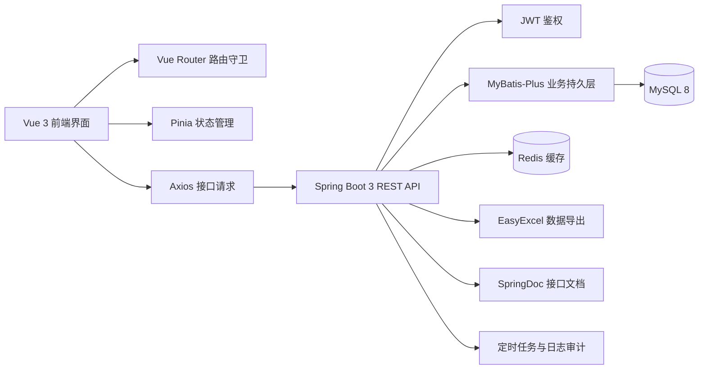
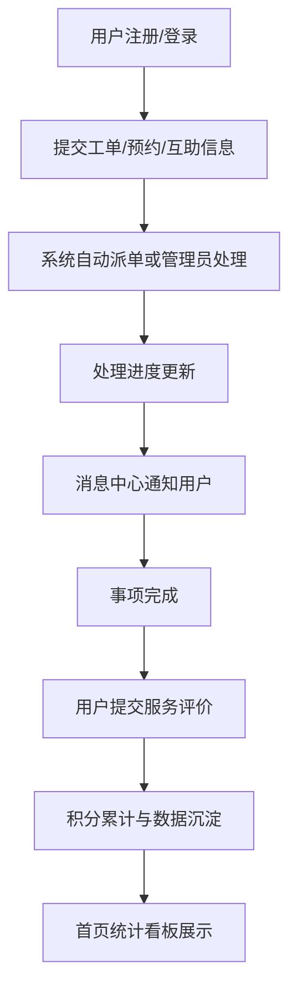

<div align="center">
  <h1>社区综合治理服务系统</h1>
  <p><strong>基于 Vue 3 + Spring Boot 3 + MySQL + Redis 的前后端分离社区治理平台</strong></p>
  <p>适用于毕业设计、课程设计、综合实训与社区信息化平台原型展示</p>
  <p>
    
    
    
    
    
    
  </p>
  <p>
    
    
    
    
  </p>
</div>

---

<a id="navigation"></a>
## 快速导航

- [项目速览](#overview)
- [功能矩阵](#features)
- [技术架构](#architecture)
- [核心亮点](#highlights)
- [业务闭环](#workflow)
- [项目结构](#structure)
- [快速启动](#quickstart)
- [数据库脚本](#database)
- [默认账号](#accounts)
- [文档入口](#docs)
- [适用场景](#scenes)
- [注意事项](#notes)

<a id="overview"></a>
## 项目速览

> 一个围绕“居民管理、社区服务、工单治理、治安管理、通知公告、数据统计”展开的综合型社区治理平台。

| 维度 | 内容 |
| --- | --- |
| 项目名称 | 社区综合治理服务系统 |
| 项目定位 | 面向社区管理、居民服务与基层治理的数字化平台 |
| 技术形态 | 前后端分离 Web 项目 |
| 前端技术 | Vue 3、Vite、Element Plus、Pinia、Axios、ECharts |
| 后端技术 | Spring Boot 3、MyBatis-Plus、JWT、Spring AOP、Validation |
| 数据存储 | MySQL 8、Redis |
| 核心能力 | 登录鉴权、居民管理、工单治理、服务评价、自动派单、消息中心、积分中心 |
| 使用场景 | 毕业设计、课程设计、实训项目、业务原型展示 |

本项目不仅覆盖了基础的增删改查功能，还补充了更适合答辩展示的业务闭环能力，例如：自动派单、工单超时治理、服务评价、站内消息、积分体系、首页数据看板等，使项目更完整、更具系统性。

<a id="features"></a>
## 功能矩阵

| 模块 | 主要能力 | 典型使用角色 |
| --- | --- | --- |
| 用户与权限 | 注册登录、JWT 鉴权、角色区分、个人中心、密码修改 | 管理员、普通用户 |
| 居民管理 | 居民档案维护、家庭关系维护、居住状态管理、导出 Excel | 管理员 |
| 社区事务 | 社区活动发布、活动报名、志愿者管理、通知公告 | 管理员、居民 |
| 服务成长 | 办事指南、服务预约、邻里互助、消息中心、积分中心 | 管理员、居民 |
| 工单治理 | 工单提交、派单、处理、超时标记、超时看板、评价闭环 | 管理员、居民 |
| 治安管理 | 流动人口登记、到期巡检、治安隐患处理 | 管理员 |
| 数据统计 | 首页看板、工单趋势、活动分布、居民统计 | 管理员 |
| 系统能力 | 文件上传、Excel 导出、操作日志、Swagger 文档、定时任务 | 管理员 |

<a id="architecture"></a>
## 技术架构



<a id="highlights"></a>
## 核心亮点

### 1. 首屏数据看板

- 首页汇总居民总数、社区活动、待处理工单、超时工单、今日待办、工单完成率
- 使用 `ECharts` 展示工单类型分布、月度趋势、活动类型分布与综合统计
- 适合做毕业设计答辩时的系统成果总览展示

### 2. 工单治理闭环更完整

- 支持工单创建、编辑、处理、关闭
- 支持要求完成时间与超时工单自动扫描
- 支持自动派单规则配置
- 支持工单完成后的服务评价，形成完整闭环

### 3. 更贴近真实社区业务

- 居民管理、活动管理、志愿者管理、流动人口、治安隐患等模块组合较完整
- 除基础管理外，还提供预约、互助、积分、消息等便民功能
- 更适合作为“综合治理平台”而不是单一 CRUD 项目展示

### 4. 便于二次扩展

- 前后端分层清晰，页面、接口、服务、数据访问职责明确
- 后端统一返回结构、异常处理、日志切面等基础设施较完善
- 适合后续继续扩展 RBAC、对象存储、Docker 部署、小程序端等能力

<a id="workflow"></a>
## 业务闭环



这个闭环体现了项目从“业务发起”到“处理反馈”再到“评价沉淀”的完整治理流程，是本仓库最适合在首页展示的核心价值之一。

<a id="structure"></a>
## 项目结构

```text
.
├─ qianduan/                             # 前端项目
│  ├─ src/
│  │  ├─ api/                           # 接口封装
│  │  ├─ router/                        # 前端路由
│  │  ├─ stores/                        # Pinia 状态管理
│  │  ├─ utils/                         # 工具方法
│  │  └─ views/                         # 页面视图
│  │     ├─ activity/                   # 社区活动
│  │     ├─ appointment/                # 服务预约
│  │     ├─ dashboard/                  # 工单超时看板
│  │     ├─ dispatchrule/               # 派单规则
│  │     ├─ evaluation/                 # 服务评价
│  │     ├─ floating/                   # 流动人口
│  │     ├─ guide/                      # 办事指南
│  │     ├─ hazard/                     # 治安隐患
│  │     ├─ log/                        # 操作日志
│  │     ├─ message/                    # 消息中心
│  │     ├─ neighborhelp/               # 邻里互助
│  │     ├─ notice/                     # 通知公告
│  │     ├─ points/                     # 积分中心
│  │     ├─ resident/                   # 居民管理
│  │     ├─ user/                       # 用户管理
│  │     ├─ volunteer/                  # 志愿者管理
│  │     └─ workorder/                  # 工单管理
│  ├─ package.json
│  └─ vite.config.js
├─ houduan/                              # 后端项目
│  ├─ src/main/java/com/community/
│  │  ├─ annotation/                    # 自定义注解
│  │  ├─ aspect/                        # AOP 切面
│  │  ├─ common/                        # 通用返回与常量
│  │  ├─ config/                        # 配置类
│  │  ├─ controller/                    # 控制层
│  │  ├─ entity/                        # 实体类
│  │  ├─ mapper/                        # 数据访问层
│  │  ├─ service/                       # 业务层
│  │  ├─ task/                          # 定时任务
│  │  └─ utils/                         # 工具类
│  ├─ src/main/resources/
│  │  ├─ application.yml                # 后端配置
│  │  └─ sql/                           # 数据库脚本
│  └─ pom.xml
├─ API_DOC.md
├─ 环境配置指南.md
└─ README.md
```

<a id="quickstart"></a>
## 快速启动

### 环境要求

- `JDK 17`
- `Maven 3.8+`
- `Node.js 18+`
- `MySQL 8.0`
- `Redis 6+`

### 1. 克隆仓库

```bash
git clone https://github.com/Hr-byte-art/community-management-platform.git
cd community-management-platform
```

### 2. 初始化数据库

项目数据库名默认为 `community_service`，SQL 脚本位于 `houduan/src/main/resources/sql`。

如果你的本地数据库账号、密码或端口不同，请修改：

- `houduan/src/main/resources/application.yml`

### 3. 启动后端

```bash
cd houduan
mvn clean install
mvn spring-boot:run
```

- 后端地址：`http://localhost:8080`
- Swagger 地址：`http://localhost:8080/swagger-ui/index.html`

### 4. 启动前端

```bash
cd qianduan
npm install
npm run dev
```

- 前端地址：`http://localhost:5173`
- 已配置开发代理：`/api -> http://localhost:8080`

<a id="database"></a>
## 数据库脚本

推荐按以下顺序执行脚本：

1. `houduan/src/main/resources/sql/init.sql`
2. `houduan/src/main/resources/sql/sprint1_message.sql`
3. `houduan/src/main/resources/sql/sprint1_points.sql`
4. `houduan/src/main/resources/sql/sprint2_workorder_overtime.sql`
5. `houduan/src/main/resources/sql/sprint3_p1_evaluation_dispatch.sql`
6. `houduan/src/main/resources/sql/indexes.sql`

对应能力如下：

| 脚本 | 作用 |
| --- | --- |
| `init.sql` | 初始化基础表结构与演示数据 |
| `sprint1_message.sql` | 新增消息中心相关表 |
| `sprint1_points.sql` | 新增积分账户与积分流水 |
| `sprint2_workorder_overtime.sql` | 增加工单超时治理字段与索引 |
| `sprint3_p1_evaluation_dispatch.sql` | 增加服务评价与自动派单规则 |
| `indexes.sql` | 补充索引优化 |

<a id="accounts"></a>
## 默认账号

| 用户名 | 密码 | 角色 |
| --- | --- | --- |
| `admin` | `123456` | 管理员 |
| `zhouba` | `123456` | 管理员 |
| `zhangsan` | `123456` | 普通用户 |
| `lisi` | `123456` | 普通用户 |

说明：数据库中存储的是加密后的密码值，登录时使用明文密码 `123456`。

<a id="docs"></a>
## 文档入口

- 接口说明：[`API_DOC.md`](./API_DOC.md)
- 环境配置：[`环境配置指南.md`](./环境配置指南.md)
- 数据库初始化：[`houduan/src/main/resources/sql/init.sql`](./houduan/src/main/resources/sql/init.sql)
- 前端入口：[`qianduan/src/main.js`](./qianduan/src/main.js)
- 后端启动类：[`houduan/src/main/java/com/community/CommunityApplication.java`](./houduan/src/main/java/com/community/CommunityApplication.java)

<a id="scenes"></a>
## 适用场景

- 毕业设计答辩展示
- 软件工程课程设计
- Spring Boot + Vue 前后端分离综合实训
- 社区治理信息化平台原型设计
- 含权限、业务、统计、日志、导出完整链路的练手项目

<a id="notes"></a>
## 注意事项

- 首次运行前请先执行数据库脚本
- 后端启用了 Redis 缓存，建议启动服务前先确认本地 Redis 可用
- 若准备公开仓库，建议优先检查并脱敏数据库、Redis、JWT 等敏感配置
- 当前项目更偏向教学、演示与毕设场景，生产环境落地前仍建议补充安全与运维能力

## 后续可扩展方向

- 引入更细粒度的 RBAC 权限控制
- 升级密码加密方案为 `BCrypt`
- 增加对象存储、图片压缩与 CDN 支持
- 增加短信、邮件、站内推送等通知通道
- 增加 Docker 部署与 CI/CD 流程
- 对接小程序端或移动端

---

<div align="center">
  <sub>如果这个项目对你有帮助，欢迎点一个 Star ⭐</sub>
</div>
